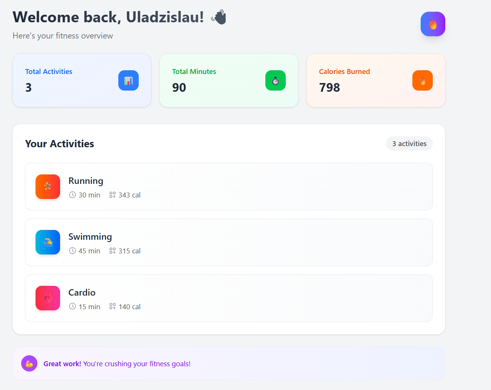
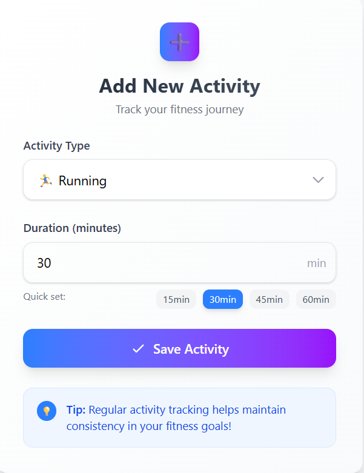
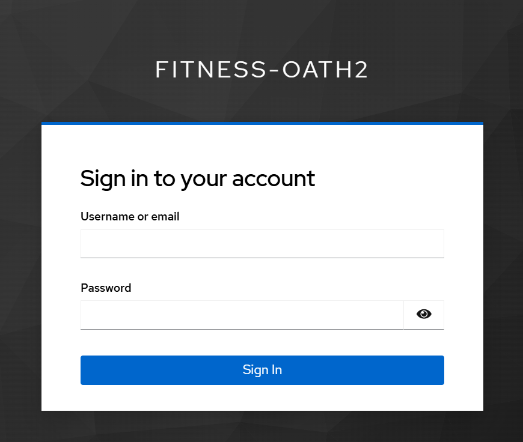
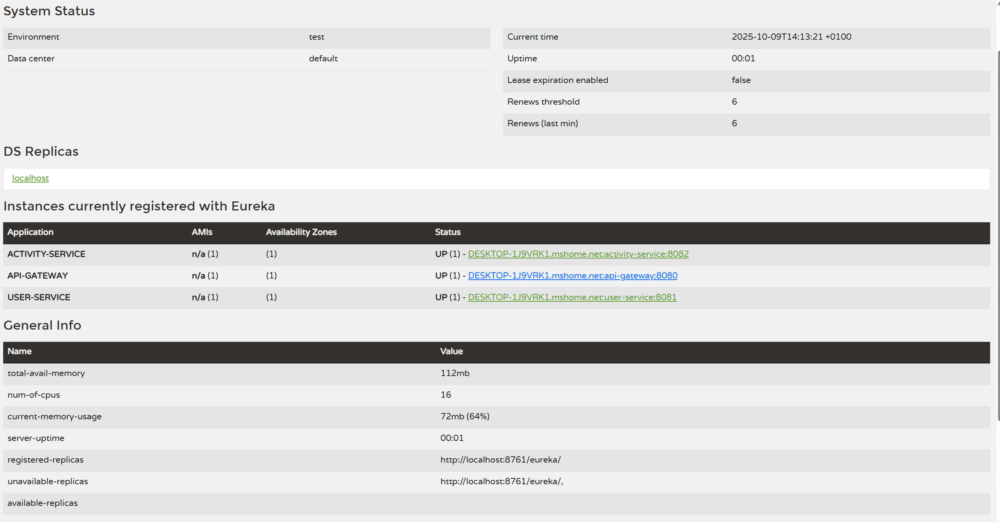

# 🏋️‍♂️ Fitness Tracker – Microservices Backend

A fully functional **Fitness Tracker microservices backend** built with **Spring Boot 3**, **Spring Cloud**, and **Keycloak** for secure authentication.  
This project demonstrates a modern cloud-ready architecture with service discovery, centralized configuration, gateway routing, and OAuth2 integration.

---

## 🖼️ Screenshots

| Dashboard | Add Activity | Keycloak Login | Eureka Dashboard |
|------------|--------------|----------------|------------------|
|  |  |  |  |


## ⚙️ Architecture Overview

```
Frontend (React + Vite + Tailwind)
          │
          ▼
 ┌───────────────────────┐
 │      API Gateway      │  ← JWT validation (Keycloak)
 │  (Spring Cloud GW)    │
 └──────────┬────────────┘
            │ routes
 ┌──────────┴────────────┐
 │     User Service      │  ← manages user profiles (PostgreSQL)
 └──────────┬────────────┘
 │
 ▼
 ┌──────────┴────────────┐
 │   Activity Service     │  ← tracks workouts, calories, durations
 └────────────────────────┘
```

---

## 🧩 Main Features

- 🧠 **Service Discovery** – via **Eureka Server**
- ⚙️ **Centralized Configuration** – via **Config Server**
- 🔐 **Authentication & Authorization** – integrated **Keycloak (OpenID Connect)**
- 🚪 **API Gateway** – routing & CORS configuration
- 🧍 **User Service** – manages user profiles synchronized with Keycloak
- 💪 **Activity Service** – tracks user activities and calculates burned calories
- 🗄️ **PostgreSQL Databases** for persistent storage
- ☁️ **Spring Cloud Load Balancer** – used between microservices
- 🧰 **Reactive WebClient** for inter-service communication

---

## 🧱 Technologies

| Layer | Stack |
|-------|--------|
| Backend | Java 21, Spring Boot 3, Spring Cloud, Spring Security |
| Auth | Keycloak (OpenID Connect, OAuth2) |
| Database | PostgreSQL |
| Dev Tools | IntelliJ IDEA, Maven |
| Infrastructure | Eureka, Config Server, API Gateway |

---

## 🚀 How It Works

1. **Admin** creates users in Keycloak Admin Console.
2. **User** logs in through the React frontend (redirected to Keycloak).
3. **Gateway** validates the JWT token.
4. **User Service** automatically registers the user if not yet in DB.
5. **Activity Service** allows tracking workouts for the authenticated user.

---

## 🧠 Keycloak Setup

- Realm: `fitness-oath2`
- Client: `oath2-pkce-client`
- Redirect URI: `http://localhost:5173/*`
- Web Origins: `http://localhost:5173`
- Auth Flow: **Standard + Direct Access Grants** (PKCE: S256)

---

## 🧭 Microservices Ports

| Service | Port |
|----------|------|
| Config Server | 8888 |
| Eureka Server | 8761 |
| API Gateway | 8080 |
| User Service | 8081 |
| Activity Service | 8082 |
| Keycloak | 8181 |

---

## 🧰 How to Run (Development)

1️⃣ Start Keycloak on port `8181`:
```bash
cd C:\keycloak\bin
.\kc.bat start-dev --http-port=8181
```

2️⃣ Start the Spring Boot services in this order:
```
1. Config Server
2. Eureka Server
3. API Gateway
4. User Service
5. Activity Service
```

3️⃣ Launch the frontend (optional):
```bash
npm run dev
```

---

## 👨‍💻 Author

Developed by **Vlad Bulahov**  
🔗 GitHub: [RaxRot](https://github.com/RaxRot)

---

## 🧾 License

This project is open-source and free to use for educational or demonstration purposes.
